# JobTrack AI

**A full-stack job application tracker with AI resume analysis, a grounded AI assistant and an MCP server.**

Track every application from wishlist to offer, schedule interviews, keep resumes private, see how
your search is going — and let AI help: compare your resume with a job description, ask questions
about your own data, or connect your favourite AI client through the Model Context Protocol.

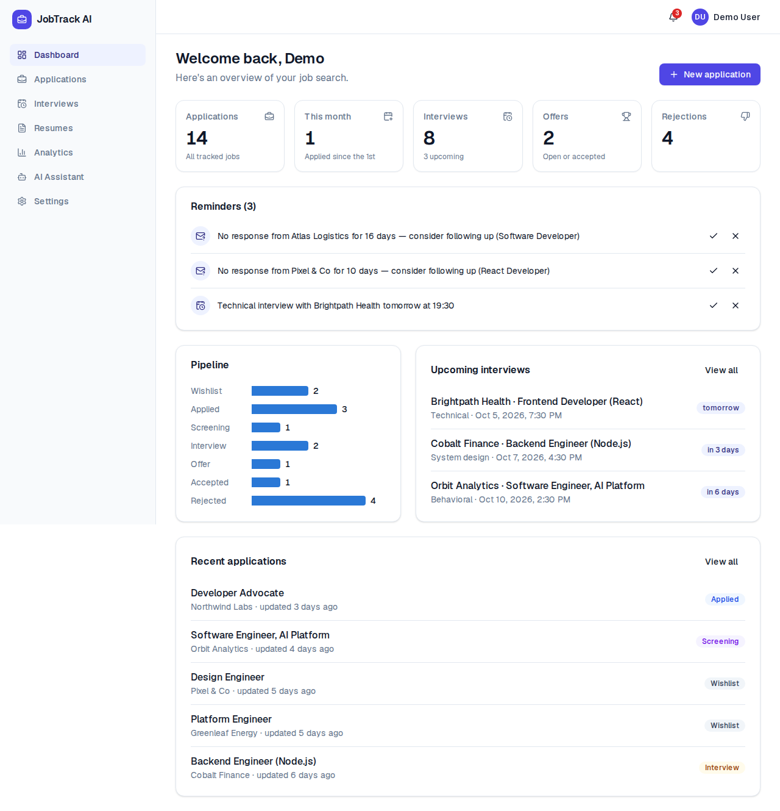

**Highlights**

- 🔐 Secure multi-user app: database sessions, ownership checks in every query **and** in the database (composite foreign keys), CSP, rate limits
- 🤖 Claude-powered resume analysis with **structured outputs** validated twice before use
- 💬 AI assistant that answers from your data through **tool use** — and says so when it doesn't know
- 🔌 **MCP server** so Claude Code, Claude Desktop or any MCP client can manage your applications with a revocable token
- ✅ 158 unit/integration tests against real PostgreSQL + 8 Playwright end-to-end tests, all in CI

---

## Contents

[Features](#features) · [Tech stack](#tech-stack) · [Architecture](#architecture) · [Database](#database) · [Screenshots](#screenshots) · [Local setup](#local-setup) · [Environment variables](#environment-variables) · [Testing](#testing) · [Deployment](#deployment) · [MCP](#mcp-model-context-protocol) · [Security](#security) · [Project docs](#project-docs) · [Future improvements](#future-improvements)

---

## Features

| Area                   | What you can do                                                                                                                                  |
| ---------------------- | ------------------------------------------------------------------------------------------------------------------------------------------------ |
| **Accounts**           | Register, log in/out, edit profile, change password (signs out other devices), delete account (removes data **and** files), time-zone preference |
| **Applications**       | Create, view, edit, delete; company reuse; salary ranges; 7-stage pipeline with **status history**; notes; search, filter, sort, paginate        |
| **Dashboard**          | Totals, this month, interviews, offers, rejections, pipeline chart, upcoming interviews, recent activity, reminders                              |
| **Interviews**         | Schedule against an application; type, interviewer, meeting link, notes, status; correct across **time zones and DST**                           |
| **Resumes**            | Private PDF uploads (size, type and magic-byte checks), primary resume, authenticated viewing                                                    |
| **AI resume analysis** | Match score, matching/missing skills, relevant experience, weak areas, resume and tailoring suggestions                                          |
| **AI assistant**       | "Which companies haven't responded?" — answers from your data via read-only tools                                                                |
| **Reminders**          | No response after 7 days, follow-up due, interview today/tomorrow; idempotent; auto-resolve                                                      |
| **Analytics**          | Applications per month, response/interview/offer/rejection rates, average & median response time, by company and location                        |
| **MCP server**         | 8 tools (read + write) over Streamable HTTP with personal API tokens                                                                             |
| **REST API**           | `/api/v1/*` for applications, notes, interviews, resumes, analyses, reminders, tokens                                                            |

## Tech stack

| Layer    | Technology                                                                                                                                            |
| -------- | ----------------------------------------------------------------------------------------------------------------------------------------------------- |
| Frontend | Next.js 16 (App Router, React Server Components), React 19, TypeScript, Tailwind CSS 4, shadcn/ui-style components (Radix), React Hook Form, Recharts |
| Backend  | Next.js Route Handlers + Server Actions, a typed service layer, Zod validation                                                                        |
| Database | PostgreSQL 16, Prisma 7 (driver adapter, migrations, partial indexes)                                                                                 |
| Auth     | Better Auth (email/password, database sessions, rate limiting)                                                                                        |
| AI       | Claude API via the Anthropic TypeScript SDK — structured outputs, tool runner, refusal fallback                                                       |
| MCP      | Official MCP TypeScript SDK (web-standard Streamable HTTP transport)                                                                                  |
| Storage  | Local private folder or S3-compatible (Cloudflare R2)                                                                                                 |
| Testing  | Vitest (unit + integration on real Postgres), Playwright (E2E), coverage                                                                              |
| DevOps   | GitHub Actions CI, Docker (standalone output), Vercel config, ESLint, Prettier, pnpm                                                                  |

## Architecture

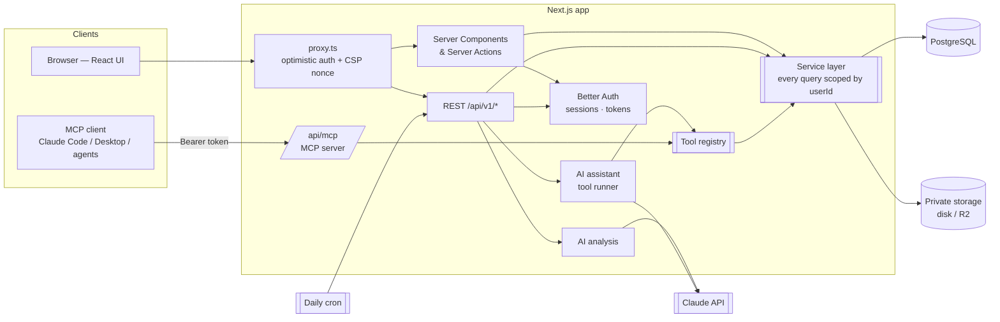

**One rule keeps data safe:** every entry point — page, Server Action, REST route, AI tool, MCP
tool — first authenticates (session cookie or hashed API token), then calls the service layer with
that user's id. Services always filter by it; the database's composite foreign keys reject any row
that would link one user's data to another's. Tools never accept a user id as input.

More: [architecture](docs/02-architecture.md) · [auth](docs/06-authentication.md) · [assistant](docs/12-ai-assistant.md) · [MCP](docs/13-mcp.md)

## Database

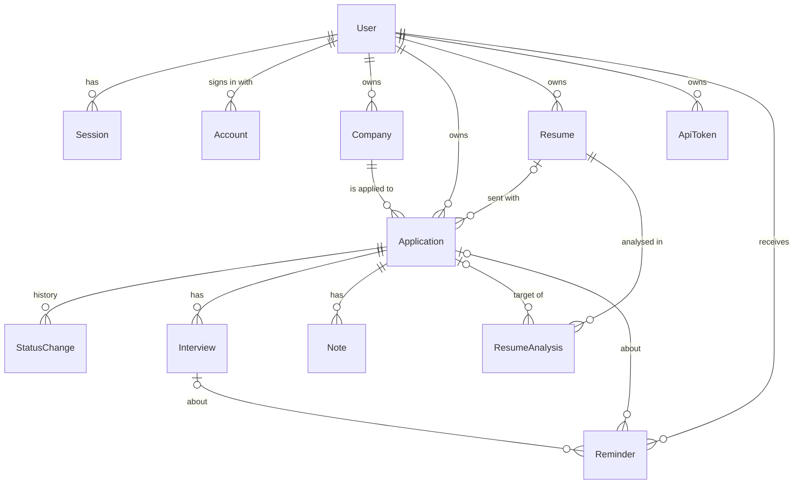

12 domain tables + auth and rate-limit tables. Composite foreign keys `(parentId, userId)` enforce
ownership in the database; CHECK constraints guard salaries, durations, file sizes and AI scores; a
partial unique index allows exactly one primary resume per user. Details:
[database design](docs/03-database.md).

## Screenshots

|                                                                                                |                                                                                                                |
| ---------------------------------------------------------------------------------------------- | -------------------------------------------------------------------------------------------------------------- |
| 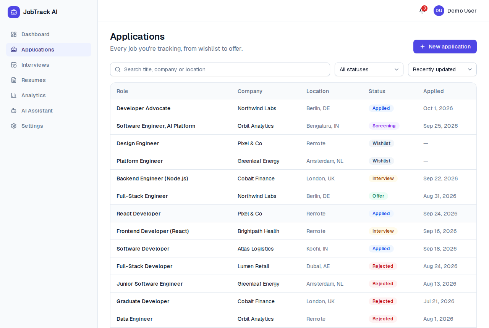 **Applications** — search, filter, sort     | 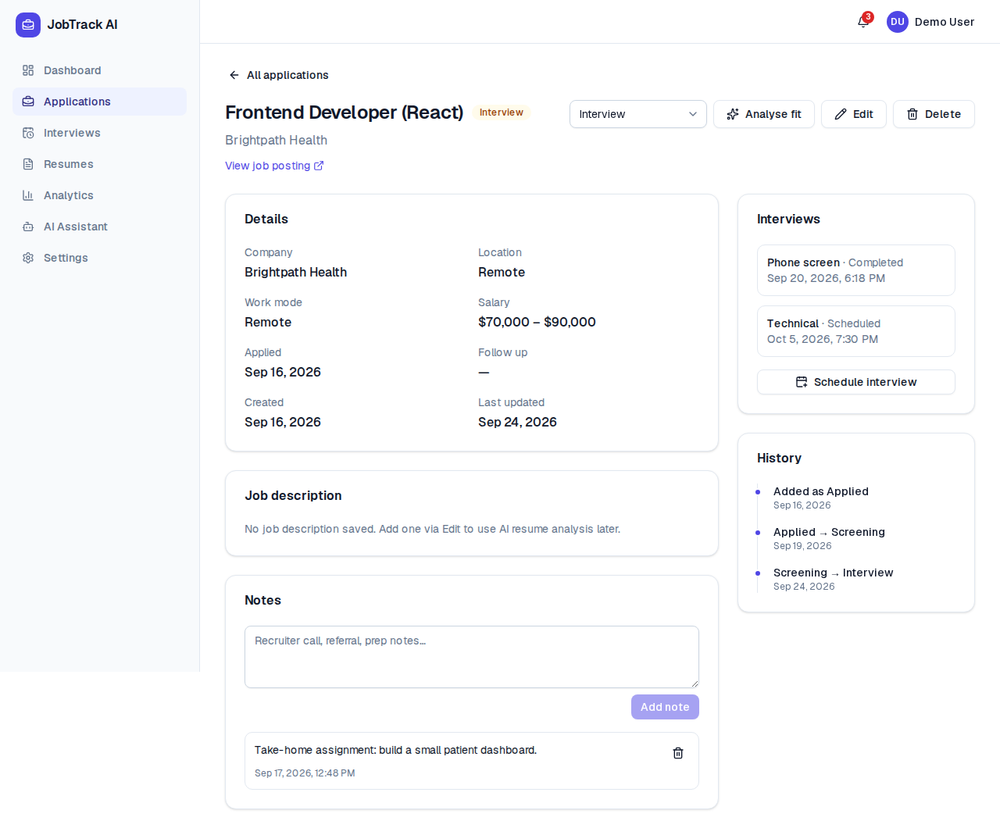 **Detail** — status, notes, interviews, history |
| 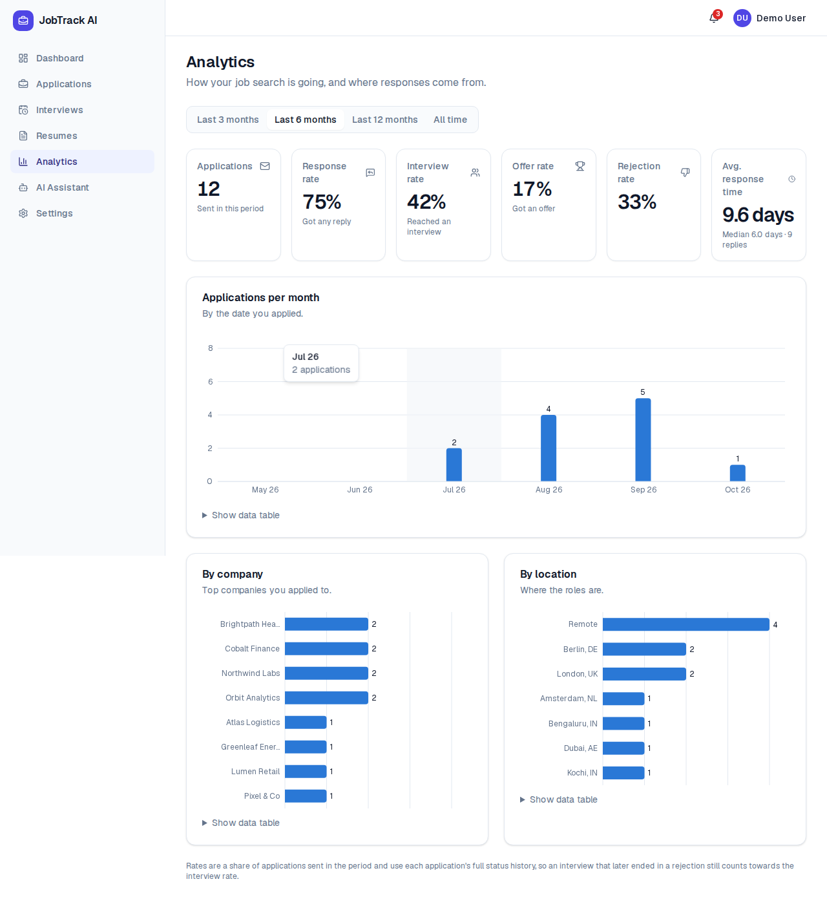 **Analytics** — rates, trends, breakdowns         | 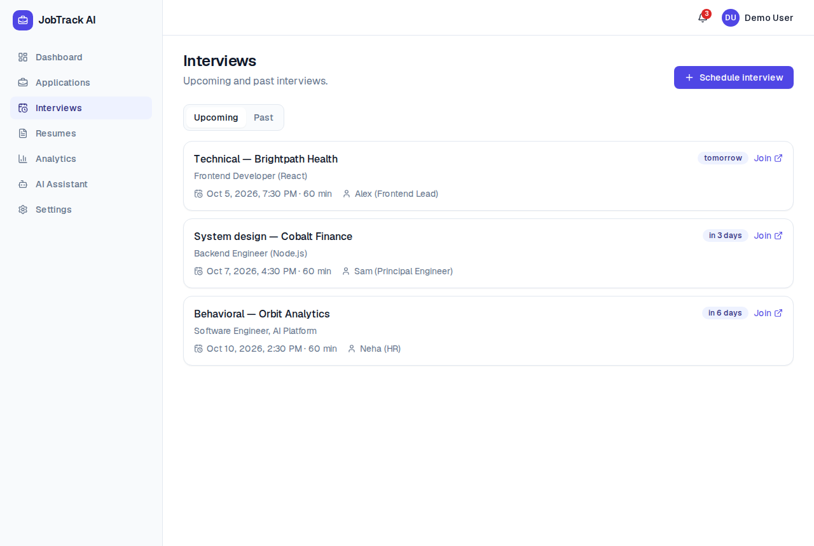 **Interviews** — in your time zone                              |
| 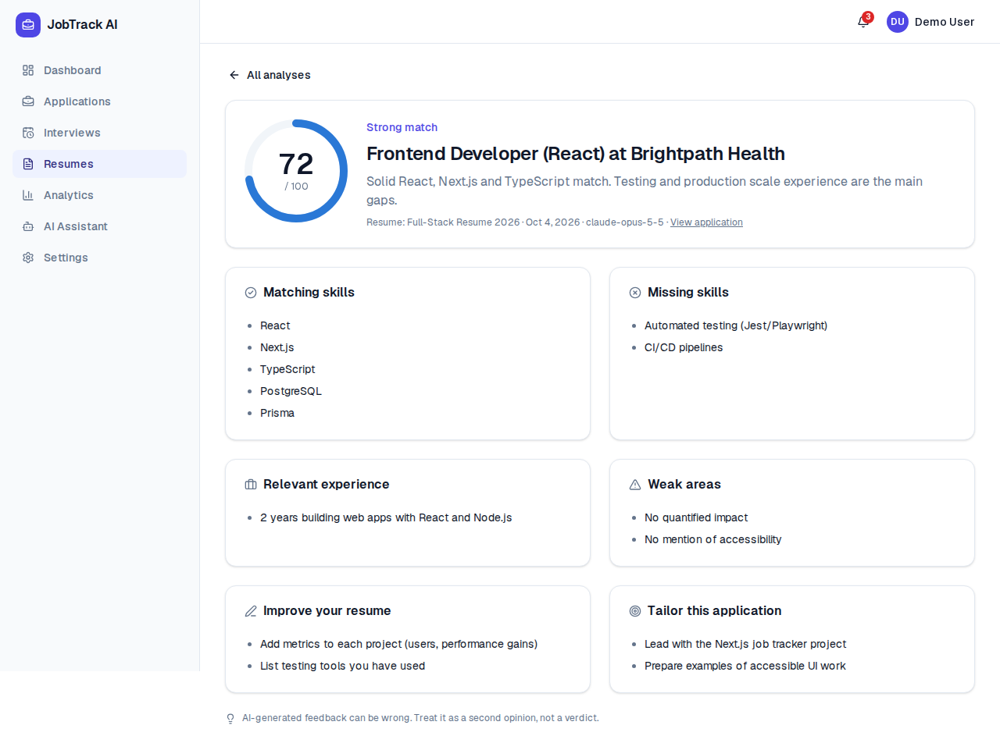 **AI resume analysis**                        | 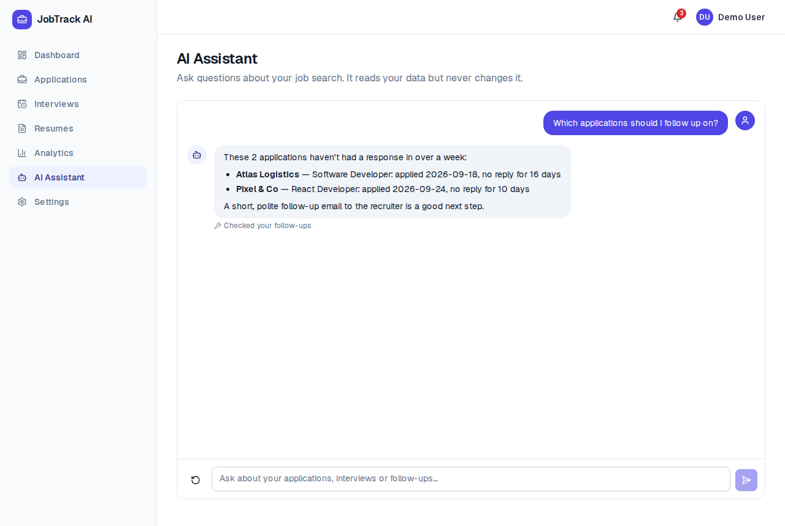 **AI assistant** — answers via tools                        |
| 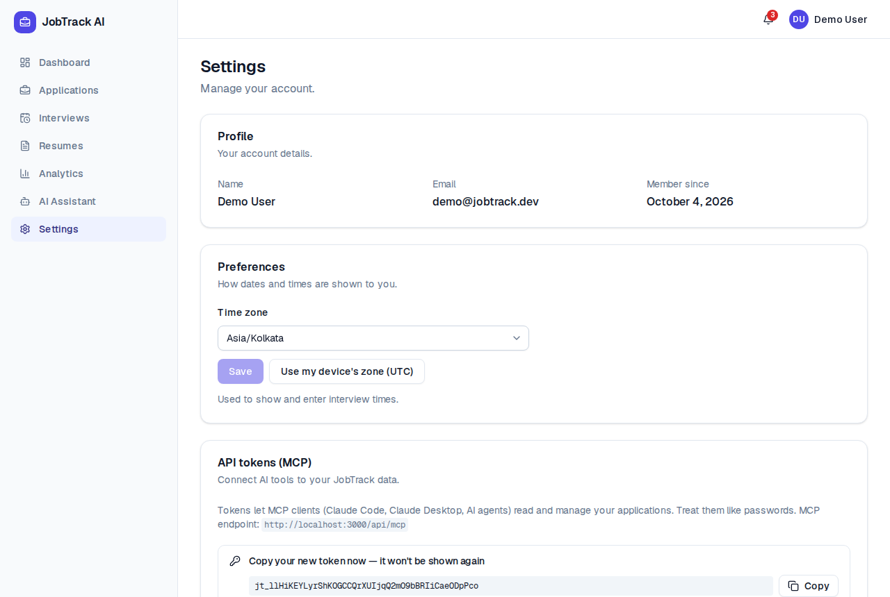 **MCP tokens** — shown once, revocable | 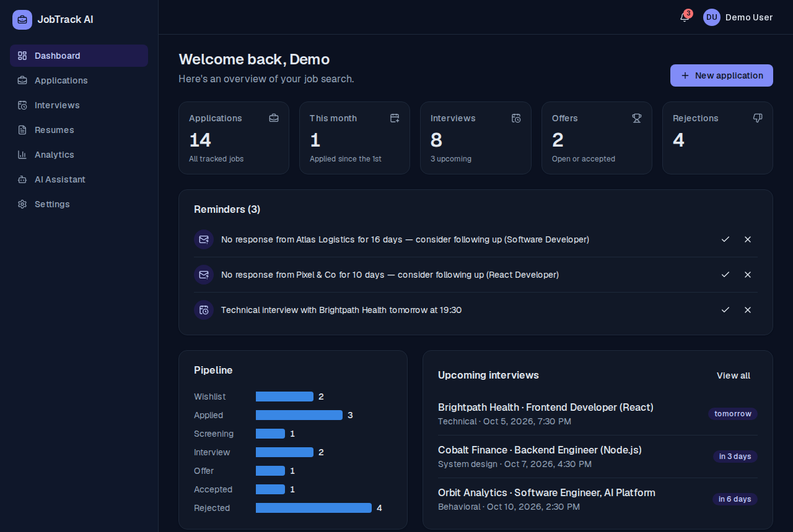 **Dark mode**                                                |

<p>
  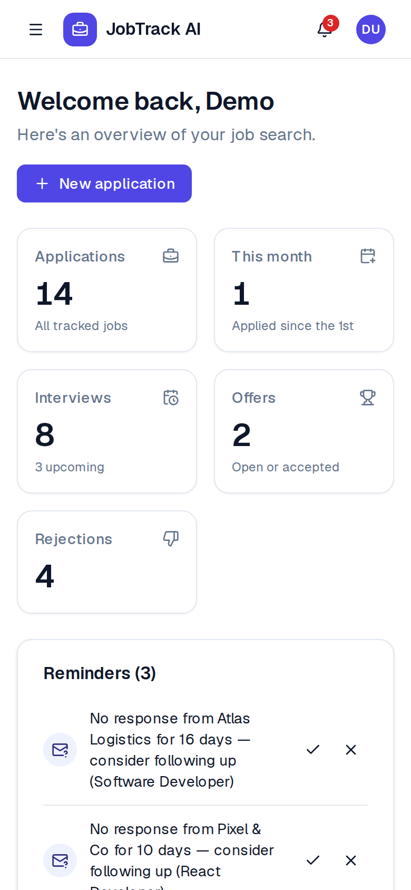
  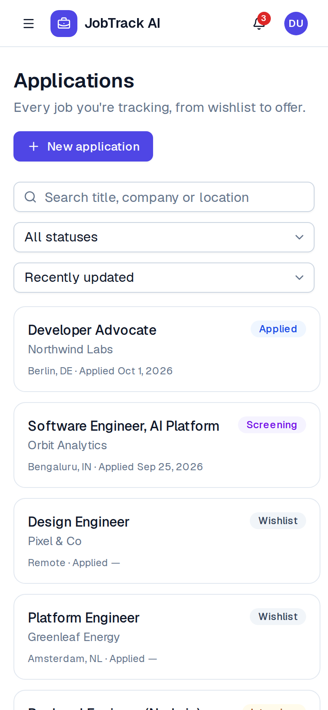
</p>

> The AI screenshots were recorded in development against a local stand-in for the Claude API (no
> API key in that environment). The assistant's answer used the real follow-up tool and real demo
> data; with `ANTHROPIC_API_KEY` set, Claude writes the text.

## Local setup

**Prerequisites:** Node.js 22, pnpm (`corepack enable`), Docker Desktop.

```bash
git clone https://github.com/irfan-arakkal/Job-Track-AI.git
cd Job-Track-AI
cp .env.example .env          # then set BETTER_AUTH_SECRET (openssl rand -base64 32)
pnpm install                  # also generates the Prisma client
pnpm db:up                    # PostgreSQL in Docker (+ test and e2e databases)
pnpm db:migrate               # create tables
pnpm db:seed                  # demo data
pnpm dev                      # http://localhost:3000
```

**Demo account:** `demo@jobtrack.dev` / `demo-password-123` — 14 applications across every stage,
interviews, notes and reminders. Add an `ANTHROPIC_API_KEY` to `.env` to use the AI features.

| Script                                                                        | What it does                                   |
| ----------------------------------------------------------------------------- | ---------------------------------------------- |
| `pnpm dev` / `pnpm build` / `pnpm start`                                      | Develop, build, run production                 |
| `pnpm check`                                                                  | Typecheck + lint + format check                |
| `pnpm test` · `test:unit` · `test:integration` · `test:e2e` · `test:coverage` | Tests                                          |
| `pnpm db:up` / `db:down`                                                      | Start/stop local Postgres                      |
| `pnpm db:migrate` / `db:deploy` / `db:seed` / `db:studio`                     | Migrations (dev / prod), demo data, DB browser |

## Environment variables

| Variable                                 | Required           | Purpose                                                        |
| ---------------------------------------- | ------------------ | -------------------------------------------------------------- |
| `DATABASE_URL`                           | ✅                 | PostgreSQL connection string                                   |
| `BETTER_AUTH_SECRET`                     | ✅                 | Signs session cookies (≥ 32 chars)                             |
| `BETTER_AUTH_URL`, `NEXT_PUBLIC_APP_URL` | ✅                 | Public URL of the app                                          |
| `TRUSTED_IP_HEADERS`                     | ✅ in prod         | Header your proxy sets with the real client IP (rate limiting) |
| `STORAGE_DRIVER` + `S3_*`                | prod on serverless | `local` or `s3` (R2/S3) for resume files                       |
| `ANTHROPIC_API_KEY`, `ANTHROPIC_MODEL`   | optional           | Enables AI (default model `claude-opus-5-5`)                   |
| `CRON_SECRET`                            | recommended        | Protects the daily reminders job                               |
| `RESEND_API_KEY`, `EMAIL_FROM`           | optional           | Sends password reset emails (Resend)                           |
| `TEST_DATABASE_URL`, `E2E_DATABASE_URL`  | for tests          | Separate databases for tests                                   |

All variables are validated at startup by [`src/env.ts`](src/env.ts); see [`.env.example`](.env.example).

## Testing

| Layer       | Tool                | Tests | Covers                                                                                                                                              |
| ----------- | ------------------- | ----- | --------------------------------------------------------------------------------------------------------------------------------------------------- |
| Unit        | Vitest              | 70    | schemas, time zones & DST, reminder rules, analytics maths, AI error mapping, PDF checks                                                            |
| Integration | Vitest + PostgreSQL | 88    | services + DB: ownership for every entity, constraints, uploads, AI with a fake model, tools, MCP via the official client, rate limiter concurrency |
| End-to-end  | Playwright          | 8     | register → login → create application → update status → dashboard; cross-user isolation; error cases                                                |

Business-logic coverage ≈ 80% of lines. CI runs everything on each pull request. Details and the bugs
the tests caught: [docs/16-testing.md](docs/16-testing.md).

## Deployment

- **Vercel + Neon + Cloudflare R2** (recommended): `vercel.json` runs migrations before each build and
  schedules the daily reminders job.
- **Docker:** multi-stage image (standalone output, non-root, healthcheck) and `docker-compose.prod.yml`
  (Postgres → migrations → app).

Step-by-step guide, env reference and post-deploy checklist: [docs/18-deployment.md](docs/18-deployment.md).

## MCP (Model Context Protocol)

MCP is an open standard that lets AI applications use external tools. JobTrack exposes an MCP server
at `/api/mcp`, so an AI client can work with your job search directly:

```
You → AI client (e.g. Claude Code) → MCP client → JobTrack MCP server → service layer → PostgreSQL
                                       (Bearer jt_… token → your user id; tools never take a user id)
```

Tools: `get_applications`, `get_application`, `get_interviews`, `get_statistics`,
`get_follow_up_candidates`, `create_application`, `update_application`, `delete_application`
(annotated as destructive so clients ask before deleting).

```bash
claude mcp add --transport http jobtrack http://localhost:3000/api/mcp \
  --header "Authorization: Bearer jt_YOUR_TOKEN"   # create the token in Settings → API tokens
```

The same tool definitions power the in-app assistant (read-only subset). Full explanation,
sequence diagram and client setup: [docs/13-mcp.md](docs/13-mcp.md).

## Security

Authentication, authorization in code **and** database, Zod validation everywhere, parameterised
SQL, nonce-based CSP and security headers, CSRF origin checks, PostgreSQL-backed rate limits with a
trusted client-IP header, hardened file uploads, hashed API tokens, AI output validation, clean
dependency audit. Each control, its evidence, the trade-offs and known limitations:
[docs/17-security.md](docs/17-security.md).

## Project docs

| #   | Doc                                                         | #   | Doc                                             |
| --- | ----------------------------------------------------------- | --- | ----------------------------------------------- |
| 01  | [Product requirements](docs/01-product-requirements.md)     | 10  | [Resumes & file security](docs/10-resumes.md)   |
| 02  | [Architecture](docs/02-architecture.md)                     | 11  | [AI resume analysis](docs/11-ai-analysis.md)    |
| 03  | [Database design & ERD](docs/03-database.md)                | 12  | [AI assistant & tools](docs/12-ai-assistant.md) |
| 04  | [API requirements](docs/04-api.md)                          | 13  | [MCP server](docs/13-mcp.md)                    |
| 05  | [Milestones](docs/05-roadmap.md)                            | 14  | [Reminders](docs/14-reminders.md)               |
| 06  | [Authentication & authorization](docs/06-authentication.md) | 15  | [Analytics](docs/15-analytics.md)               |
| 07  | [Job applications](docs/07-applications.md)                 | 16  | [Testing](docs/16-testing.md)                   |
| 08  | [Dashboard](docs/08-dashboard.md)                           | 17  | [Security review](docs/17-security.md)          |
| 09  | [Interviews & time zones](docs/09-interviews.md)            | 18  | [Deployment](docs/18-deployment.md)             |
|     |                                                             | 19  | [Portfolio kit](docs/19-portfolio.md)           |

## Project structure

```
prisma/                 schema, migrations, demo seed
src/
  app/                  routes: (auth) pages, (app) pages, api/ (v1 REST, auth, mcp, cron, health)
  components/           ui primitives, layout (shell, nav), shared (empty states, badges…)
  features/             per-feature UI, Server Actions and Zod schemas
  lib/                  shared pure helpers (formatting, time zones, reminder rules, analytics)
  server/               server-only: db, auth, session, services, tools, ai, mcp, storage, rate limit
  proxy.ts              optimistic route protection + CSP
tests/                  unit/, integration/, e2e/
docs/                   design docs per phase + screenshots
```

## Future improvements

- Email verification, password reset and email digests for reminders
- Two-factor authentication (TOTP)
- OAuth for the MCP server (remote connectors without manual tokens)
- Streaming assistant responses and saved conversations
- Kanban board view with drag-and-drop status changes
- Browser extension to save jobs from job boards
- Calendar (ICS) export for interviews
- Audit log for security events; virus scanning for uploads

---

Built by **Irfan Arakkal** as a portfolio project, incrementally in 16 documented phases.
