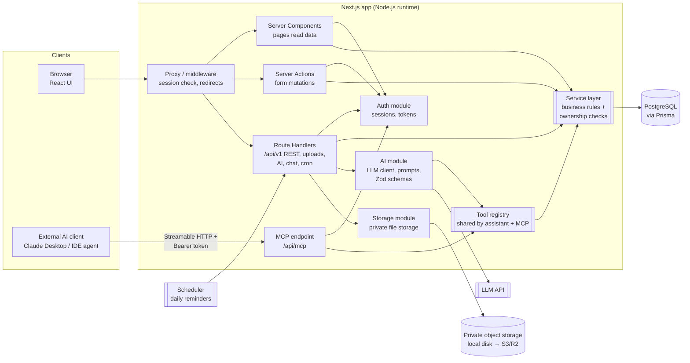
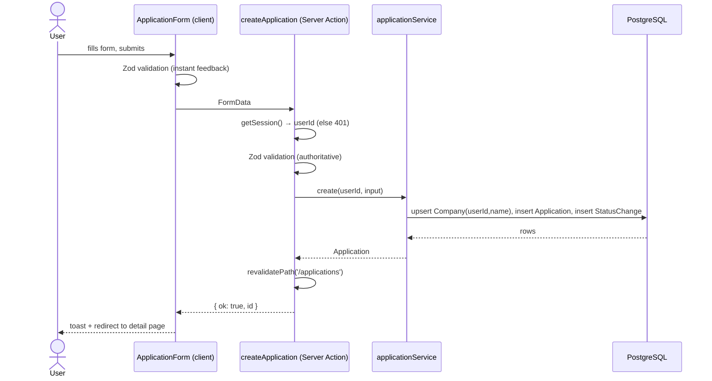
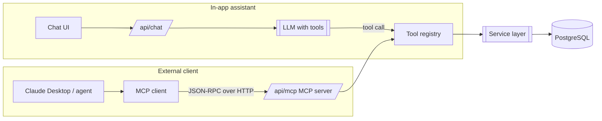

# 02 — Architecture

## 1. High-level architecture

JobTrack AI is a **single Next.js application** (a "modular monolith") backed by PostgreSQL.
One codebase serves the UI, the server logic, the REST API, the AI features and the MCP endpoint.



### The one rule that keeps data safe

Every entry point (page, Server Action, REST route, AI tool, MCP tool) does exactly two things
before touching data:

1. **Authenticate** — resolve *who* is calling (session cookie for the browser, hashed API token for MCP).
2. **Call the service layer with that `userId`.**

Services never trust IDs from the client on their own: every query includes `where: { userId }`.
So authorization is enforced in **one place**, and the UI, REST API, assistant and MCP server
all inherit the same protection. This is the design decision we'll lean on most in interviews.

```
Request → authenticate → validate input (Zod) → service(userId, input) → Prisma (where userId) → response
```

## 2. Key technology decisions

| Concern | Choice | Why | Alternatives considered |
|---------|--------|-----|-------------------------|
| Framework | **Next.js (App Router) + React + TypeScript** | Full-stack in one project; Server Components fetch data on the server with no extra API hop. | Separate React SPA + Express API (more moving parts). |
| Styling / UI | **Tailwind CSS + shadcn/ui** (Radix primitives) | Accessible, unstyled primitives we own as code; consistent design system. | MUI/Chakra (heavier, harder to customise). |
| Forms | **React Hook Form + Zod** | Same Zod schema validates on client (UX) and server (security). | Formik; plain `useActionState`. |
| DB / ORM | **PostgreSQL + Prisma** | Relational data with strong relationships; Prisma gives typed queries and migrations. | Drizzle (closer to SQL, also good). |
| Auth | **Better Auth** (recommended) with Prisma adapter | First-class email/password, DB-backed sessions, rate limiting, API-key plugin; the Auth.js project is now maintained under the Better Auth team, which recommends Better Auth for new projects. | **Auth.js v5** — mature, but its Credentials provider forces JWT sessions and is intentionally limited. Clerk — hosted, less to learn about auth itself. |
| Mutations | **Server Actions** for UI forms; **REST Route Handlers** under `/api/v1` | Server Actions = least boilerplate for forms with built-in origin checks. REST demonstrates API design and is used by external clients. Both are thin wrappers over the same services, so no duplicated logic. | tRPC (great DX, less "standard REST" for a portfolio). |
| AI | **Anthropic Claude API** with structured outputs + tool use | Structured JSON output for analysis; tool use for the grounded assistant; first-class MCP support. Final model choice made in Phase 8. | OpenAI, Gemini (similar capabilities). |
| MCP | **Official MCP TypeScript SDK**, Streamable HTTP transport at `/api/mcp`, auth via per-user hashed tokens | Lives inside the app, reuses services/auth; works with remote clients. | Standalone stdio server (local only; we may add a thin stdio wrapper for Claude Desktop). OAuth (later upgrade). |
| File storage | **Storage interface**: local private folder in dev, S3-compatible private bucket (e.g. Cloudflare R2) in prod | Files never in `public/`; downloads go through an authenticated route or short-lived signed URL. | Store PDFs in Postgres (simple, but bloats DB). |
| Charts | **Recharts** | Declarative React charts, responsive. | Chart.js, Visx. |
| Testing | **Vitest** (unit + integration against a real test Postgres), **Playwright** (E2E) | Fast, TypeScript-native; integration tests catch real SQL/authorization bugs. | Jest; Cypress. |
| Package manager | **pnpm** | Fast, strict dependency resolution. | npm (fine too). |
| Deployment | **Vercel + Neon Postgres + R2** (recommended), Dockerfile for portability | Lowest-friction for Next.js; Docker shows container skills. | Railway / Fly.io / a VPS with Docker Compose. |

## 3. Request flows

### 3.1 Creating an application (browser)



### 3.2 AI resume analysis

`POST /api/ai/analyze` → auth + rate limit → load resume text (extracted once at upload) and job
description → call LLM with a JSON schema → **validate response with Zod** → store `ResumeAnalysis`
→ return. Timeouts (e.g. 60 s), `429` from the provider and invalid JSON map to clear user-facing errors.

### 3.3 AI assistant vs. MCP



Tools are defined **once** (name, description, Zod input schema, handler that receives `userId`).
The in-app assistant calls them directly; the MCP server exposes the same tools to any MCP client.
In Phase 10 we'll also walk through the full *AI Assistant → MCP Client → MCP Server → database*
path, and optionally switch the in-app assistant to consume our own MCP server.

## 4. Recommended folder structure

Hybrid of **feature folders** (UI + actions grouped by domain) and a **server folder**
(server-only business logic). Feature folders keep related code together; the server folder
guarantees secrets and DB code never leak into client bundles (`import 'server-only'`).

```
job-track-ai/
├── prisma/
│   ├── schema.prisma          # data model
│   ├── migrations/            # generated SQL migrations (committed)
│   └── seed.ts                # demo account + sample data
├── public/                    # static assets only (never user files)
├── src/
│   ├── app/                   # Next.js routes
│   │   ├── (marketing)/       # landing page
│   │   ├── (auth)/            # login, register
│   │   ├── (app)/             # authenticated shell (sidebar layout)
│   │   │   ├── dashboard/
│   │   │   ├── applications/  # list, new, [id], [id]/edit
│   │   │   ├── interviews/
│   │   │   ├── resumes/
│   │   │   ├── analytics/
│   │   │   ├── assistant/
│   │   │   └── settings/
│   │   └── api/
│   │       ├── auth/[...all]/ # auth library handler
│   │       ├── v1/            # REST: applications, interviews, ...
│   │       ├── resumes/       # upload + authenticated download
│   │       ├── ai/            # analyze
│   │       ├── chat/          # assistant (streaming)
│   │       ├── mcp/           # MCP server endpoint
│   │       └── cron/          # protected reminder job
│   ├── components/
│   │   ├── ui/                # primitives: Button, Input, Dialog, Card...
│   │   ├── layout/            # Sidebar, Topbar, PageHeader
│   │   └── shared/            # EmptyState, ErrorState, LoadingSkeleton, StatusBadge
│   ├── features/
│   │   ├── applications/      # components/, actions.ts, schemas.ts, queries.ts
│   │   ├── interviews/
│   │   ├── resumes/
│   │   ├── dashboard/
│   │   ├── analytics/
│   │   ├── assistant/
│   │   └── reminders/
│   ├── server/                # server-only
│   │   ├── db.ts              # Prisma client singleton
│   │   ├── auth.ts            # auth config + getCurrentUser()
│   │   ├── services/          # application.service.ts, interview.service.ts, ...
│   │   ├── tools/             # shared AI/MCP tool definitions
│   │   ├── ai/                # LLM client, prompts, output schemas
│   │   ├── mcp/               # MCP server setup + token auth
│   │   ├── storage/           # StorageProvider (local | s3)
│   │   ├── errors.ts          # AppError types → HTTP mapping
│   │   ├── rate-limit.ts
│   │   └── logger.ts
│   ├── lib/                   # isomorphic helpers: utils, constants, date formatting
│   ├── env.ts                 # Zod-validated environment variables
│   └── proxy.ts               # route protection (named middleware.ts in older Next.js)
├── tests/
│   ├── unit/
│   ├── integration/
│   └── e2e/
├── docs/                      # these documents
├── .github/workflows/ci.yml
├── docker-compose.yml         # local Postgres (+ test DB)
├── Dockerfile
├── .env.example
└── README.md
```
