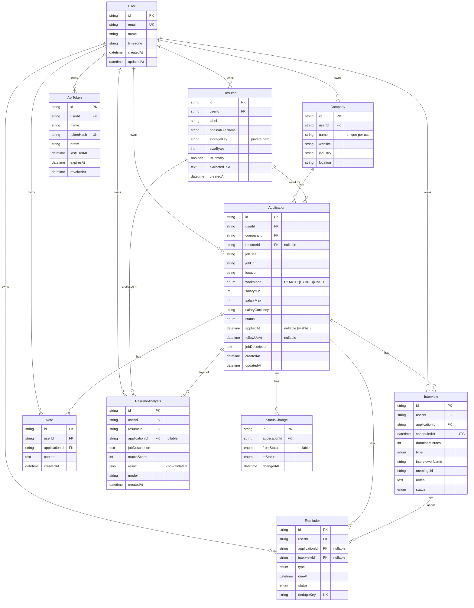

# 03 — Database Design

PostgreSQL, accessed only through Prisma. The source of truth is `prisma/schema.prisma`.

**Implementation status:** the auth tables (Phase 2) and User, Company, Application,
StatusChange, Interview, Note and Resume (Phase 3) are built. `ResumeAnalysis` (Phase 8),
`Reminder` (Phase 11) and `ApiToken` (Phase 10) arrive with their features. See
[§7 Phase 3 implementation notes](#7-phase-3-implementation-notes).

## 1. Entities

| Entity                   | Purpose                                                                                                                          |
| ------------------------ | -------------------------------------------------------------------------------------------------------------------------------- |
| **User**                 | Account + profile (name, email, timezone). Auth tables (`Session`, `Account`, `Verification`) are generated by the auth library. |
| **Company**              | An employer, owned by one user (companies are per-user, not global, to keep data private and simple).                            |
| **Application**          | A job the user is tracking. Central entity.                                                                                      |
| **StatusChange**         | History row each time an application's status changes. Powers response-time and funnel analytics.                                |
| **Interview**            | A scheduled interview for an application.                                                                                        |
| **Note**                 | Timestamped free-text note on an application.                                                                                    |
| **Resume**               | Metadata for an uploaded PDF (the file itself lives in private storage) + extracted text.                                        |
| **ResumeAnalysis**       | Stored, validated AI analysis result for a resume vs. a job description.                                                         |
| **Reminder**             | A follow-up / interview reminder generated by rules or set by the user.                                                          |
| **ApiToken**             | Hashed personal access token used by MCP clients.                                                                                |
| _Conversation / Message_ | _(Phase 9, optional)_ persisted assistant chats.                                                                                 |

## 2. Relationships

```
User 1 ──── * Company
User 1 ──── * Application * ──── 1 Company
Application 1 ──── * Interview
Application 1 ──── * Note
Application 1 ──── * StatusChange
User 1 ──── * Resume 1 ──── * ResumeAnalysis * ──── 0..1 Application
Application * ──── 0..1 Resume        (the resume used for this application)
User 1 ──── * Reminder * ──── 0..1 Application / 0..1 Interview
User 1 ──── * ApiToken
```

- **One-to-many** everywhere a parent "has many" children (a user has many applications).
- **Company ↔ Application** is many-to-one: many applications can point to one company
  (e.g. you applied to two roles at the same company).
- **Cascade deletes**: deleting a user deletes everything; deleting an application deletes its
  interviews, notes, status history and reminders. Deleting a resume sets
  `Application.resumeId` to `NULL` (we keep the application). A company cannot be deleted while
  applications reference it (`Restrict`), so we never orphan data silently.

### Why `userId` appears on child tables too

`Interview`, `Note`, `Reminder` and `ResumeAnalysis` belong to a user _through_ their parent,
but we also store `userId` directly on them. Trade-off:

- ✅ Ownership checks are a single `where: { id, userId }` — no joins, hard to get wrong.
- ✅ Fast dashboard queries like "this user's upcoming interviews" with an index on `(userId, scheduledAt)`.
- ⚠️ Redundant data that must stay consistent — the service layer sets it from the parent, never from client input.

## 3. ERD



## 4. Enums

| Enum                | Values                                                                         |
| ------------------- | ------------------------------------------------------------------------------ |
| `ApplicationStatus` | `WISHLIST, APPLIED, SCREENING, INTERVIEW, OFFER, ACCEPTED, REJECTED`           |
| `WorkMode`          | `REMOTE, HYBRID, ONSITE`                                                       |
| `InterviewType`     | `PHONE_SCREEN, TECHNICAL, BEHAVIORAL, SYSTEM_DESIGN, ONSITE, HR, FINAL, OTHER` |
| `InterviewStatus`   | `SCHEDULED, COMPLETED, CANCELLED, RESCHEDULED, NO_SHOW`                        |
| `ReminderType`      | `NO_RESPONSE, INTERVIEW_TOMORROW, INTERVIEW_TODAY, FOLLOW_UP`                  |
| `ReminderStatus`    | `PENDING, DISMISSED, DONE`                                                     |

**Status workflow.** The happy path is `Wishlist → Applied → Screening → Interview → Offer → Accepted`,
and `Rejected` can happen from any stage. We deliberately **don't** hard-block other transitions
(users need to fix mistakes), but every change is written to `StatusChange`.

## 5. Indexes & constraints

| Table        | Index / constraint                                                               | Serves                               |
| ------------ | -------------------------------------------------------------------------------- | ------------------------------------ |
| Company      | unique `(userId, name)`                                                          | reuse company by name, no duplicates |
| Application  | `(userId, status)`, `(userId, appliedAt)`, `(userId, updatedAt)`                 | filtered lists, dashboard, analytics |
| Interview    | `(userId, scheduledAt)`                                                          | upcoming interviews                  |
| Note         | `(applicationId, createdAt)`                                                     | note timeline                        |
| StatusChange | `(applicationId, changedAt)`                                                     | history, response time               |
| Resume       | at most one `isPrimary = true` per user (partial unique index via SQL migration) | primary resume                       |
| Reminder     | unique `dedupeKey`, `(userId, status, dueAt)`                                    | idempotent generation, inbox         |
| ApiToken     | unique `tokenHash`                                                               | token lookup                         |

Money is stored as integers (whole units) plus a currency code — never floats.
All timestamps are stored in UTC; the UI converts using the user's timezone.

## 6. Metric definitions (so analytics are unambiguous)

- **Response** — an application that moved from `APPLIED` to any later status (including `REJECTED`).
- **Response time** — time between `appliedAt` and the first `StatusChange` after it.
- **Response rate** — responded ÷ applied (excludes `WISHLIST`).
- **Interview rate** — applications that ever reached `INTERVIEW` ÷ applied.
- **Offer / rejection rate** — reached `OFFER` (or `ACCEPTED`) / `REJECTED` ÷ applied.
- **No-response candidate** — status `APPLIED`, `appliedAt` ≥ 7 days ago, no later status change.

## 7. Phase 3 implementation notes

### Composite foreign keys — the database enforces ownership too

A normal foreign key only checks that the parent row _exists_. If `applications.companyId`
pointed at `companies.id` alone, a bug in our code could link Alice's application to Bob's
company. Instead, child tables reference the parent by **(id, userId)**:

```sql
FOREIGN KEY ("companyId", "userId")     REFERENCES "companies"("id", "userId")      -- applications
FOREIGN KEY ("applicationId", "userId") REFERENCES "applications"("id", "userId")   -- interviews, notes
```

So the pair must exist together: the parent has to belong to the **same user**. Prisma even fills
in `userId` automatically for nested creates (`application.create({ data: { notes: { create: … } } })`),
so a child can't end up with a different owner. This is defence in depth: the service layer is the
first line of defence, and the database refuses whatever slips through.

`Application.resumeId` uses a plain foreign key, because a composite one with `ON DELETE SET NULL`
would also try to null `userId`. The resume service (Phase 7) checks ownership instead.

### Constraints Prisma can't express

The `domain_entities` migration ends with hand-written `CHECK` constraints:

| Constraint                         | Rule                     |
| ---------------------------------- | ------------------------ |
| `applications_salary_non_negative` | salaries are ≥ 0         |
| `applications_salary_range`        | `salaryMin <= salaryMax` |
| `interviews_duration_positive`     | duration > 0             |
| `resumes_size_positive`            | file size > 0            |

Prisma ignores CHECK constraints when it compares the schema to the database, so later migrations
leave them alone (verified: a diff after adding them is empty).

### One primary resume per user

Declared in the schema with the `partialIndexes` preview feature:

```prisma
@@unique([userId], map: "resumes_one_primary_per_user", where: { isPrimary: true })
```

which becomes `CREATE UNIQUE INDEX … ON "resumes"("userId") WHERE ("isPrimary" = true)`.
The index only contains primary resumes, so it allows any number of non-primary ones.

### Delete behaviour

| When you delete…                | What happens                                                 |
| ------------------------------- | ------------------------------------------------------------ |
| a user                          | everything they own is deleted (cascade)                     |
| an application                  | its interviews, notes and status history are deleted         |
| a company that applications use | refused (`NO ACTION`); delete or move the applications first |
| a resume                        | applications keep existing; their `resumeId` becomes `NULL`  |

`NO ACTION` (not `RESTRICT`) is used for companies because Postgres checks it at the end of the
statement, so deleting a user — which cascades to applications _and_ companies — still succeeds.

### Seed data

`pnpm db:seed` creates `demo@jobtrack.dev` / `demo-password-123` with 8 companies,
14 applications across every status, consistent status history, 8 interviews (3 upcoming) and
notes. Dates are relative to today. The script refuses to run in production.

### Tests

`tests/integration/` runs against the separate `jobtrack_test` database:
`application-access.test.ts` proves users only see their own applications, and
`schema-constraints.test.ts` proves every constraint above.
