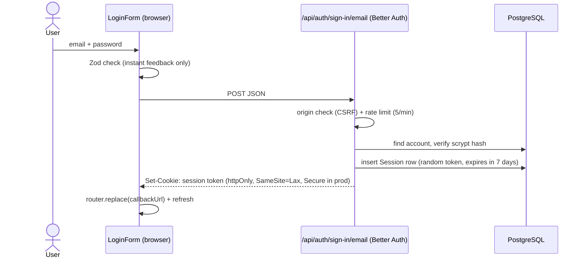

# 06 — Authentication & Authorization (Phase 2)

## The pieces

| File                                 | Role                                                                                                               |
| ------------------------------------ | ------------------------------------------------------------------------------------------------------------------ |
| `src/server/auth.ts`                 | Better Auth config: Prisma adapter, email/password rules, session lifetime, rate limits, name validation hook      |
| `src/app/api/auth/[...all]/route.ts` | Exposes Better Auth's HTTP endpoints (`/api/auth/sign-up/email`, `/sign-in/email`, `/sign-out`, `/get-session`, …) |
| `src/lib/auth-client.ts`             | Browser client used by the login/register forms and the logout button                                              |
| `src/server/session.ts`              | **Data Access Layer** for auth: `getSession()`, `getCurrentUser()`, `requireUser()`                                |
| `src/proxy.ts`                       | Optimistic redirect to `/login` when there's no session cookie                                                     |
| `src/app/(auth)/layout.tsx`          | Sends signed-in users away from `/login` and `/register`                                                           |
| `src/app/(app)/layout.tsx`           | Requires a signed-in user for every app page                                                                       |
| `src/app/api/v1/me/route.ts`         | Example protected API route (401 without a session)                                                                |

## How a login works

On every protected request the cookie is sent automatically, and `requireUser()` looks the token
up in the `sessions` table. Logging out deletes that row, so the cookie stops working immediately
— an advantage of **database sessions** over stateless JWTs, which stay valid until they expire.

## Three layers of protection

1. **Proxy (optimistic)** — no cookie → redirect to `/login?callbackUrl=…`. Fast, but a fake cookie
   gets past it, so it is only a UX convenience.
2. **Layouts / pages (real check)** — `requireUser()` validates the session against the database.
3. **Data access** — every query is scoped to `user.id` from the session, never to an ID sent by
   the client. Phase 3+ services take `userId` as their first argument to enforce this.

API routes return `401` JSON instead of redirecting (see `src/server/http.ts`).

## Security decisions

| Concern                                           | What we do                                                                                                                                                             |
| ------------------------------------------------- | ---------------------------------------------------------------------------------------------------------------------------------------------------------------------- |
| Password storage                                  | Better Auth hashes with **scrypt** (salted, slow by design). Plain passwords are never stored or logged.                                                               |
| Password rules                                    | 8–128 characters, enforced on the server (`src/lib/auth-rules.ts` shared with the forms).                                                                              |
| Session cookie                                    | `httpOnly` (JavaScript can't read it → XSS can't steal it), `SameSite=Lax`, `Secure` over HTTPS, signed with `BETTER_AUTH_SECRET`.                                     |
| CSRF                                              | Better Auth rejects requests whose `Origin` isn't our app (`403 INVALID_ORIGIN`). `SameSite=Lax` adds a second layer.                                                  |
| Brute force                                       | Rate limits: sign-in 5/min, sign-up 3/min per IP, 100/min for other auth routes.                                                                                       |
| User enumeration                                  | Login always says "Invalid email or password". Sign-up does reveal an existing email — a common trade-off for usability; can be removed with email verification later. |
| Open redirect                                     | `callbackUrl` is validated by `getSafeRedirect()` — only same-site paths are allowed.                                                                                  |
| Server-side validation                            | Better Auth validates email/password; a database hook trims and validates the name.                                                                                    |
| Why the forms call `/api/auth/*` from the browser | Rate limiting and origin checks only run on Better Auth's HTTP endpoints, not on direct `auth.api.*` calls from server code.                                           |

## Known limitations (addressed later)

- **Rate-limit storage is in memory** → resets on restart and isn't shared between server instances. Move to database/Redis storage before production (Phase 14/15).
- **Client IP comes from `X-Forwarded-For`**, which a client can spoof unless a trusted proxy (e.g. Vercel) overwrites it. Configure `advanced.ipAddress` for the hosting platform (Phase 15).
- No email verification or password reset yet (needs an email provider).
