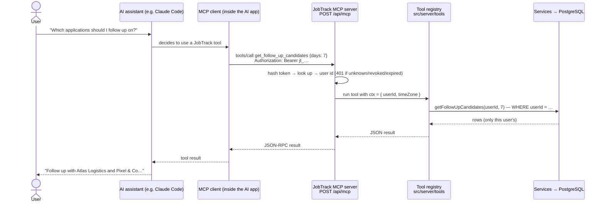

# 13 — MCP Server (Phase 10)

## What MCP is

The **Model Context Protocol** is an open standard for connecting AI applications to tools and
data. An **MCP server** describes its tools (name, description, JSON input schema) and runs them;
an **MCP client** — built into Claude Code, Claude Desktop, IDE agents and others — discovers those
tools and lets the AI call them. Instead of writing a custom integration per AI app, JobTrack
exposes one MCP server and any MCP client can use it.

## Architecture



- **Transport:** Streamable HTTP (JSON-RPC 2.0 over HTTP POST), using the official MCP TypeScript
  SDK's `WebStandardStreamableHTTPServerTransport`, which works directly with Next.js route handlers.
- **Stateless:** each request builds a fresh server bound to the token's user. No session storage,
  works on serverless hosts. Responses are plain JSON (`enableJsonResponse`).
- **Same tools as the in-app assistant** (`src/server/tools`), plus write tools.

## Tools

| Tool                       | Read-only | Notes                                                     |
| -------------------------- | --------- | --------------------------------------------------------- |
| `get_applications`         | ✅        | filter by status, search text, applied date range         |
| `get_application`          | ✅        | full detail incl. notes, interviews, history              |
| `get_interviews`           | ✅        | upcoming/past or a date range, times in the user's zone   |
| `get_statistics`           | ✅        | totals and rates                                          |
| `get_follow_up_candidates` | ✅        | no response after N days, or follow-up date due           |
| `create_application`       | —         | same validation as the UI                                 |
| `update_application`       | —         | status changes recorded in history                        |
| `delete_application`       | —         | `destructiveHint: true` → clients ask the user to confirm |

Every tool carries MCP annotations (`readOnlyHint`, `destructiveHint`, `idempotentHint`,
`openWorldHint: false`) so clients can decide what needs confirmation.

## Authorization — how a client can't reach someone else's data

1. **Personal access tokens** (Settings → API tokens): 256-bit random, prefixed `jt_`, shown
   **once**. Only a SHA-256 hash is stored. Optional expiry (7/30/90/365 days); revocable instantly;
   max 10 active per user; `lastUsedAt` recorded.
2. The token identifies **one user**. Tools receive `userId` from the token — **no tool has a user
   parameter** (tested), so there is nothing a client could set to target another account.
3. Tools call the same service layer as the web app; every query filters by that user id, and the
   database's composite foreign keys back it up.
4. Rate limit: 120 requests/minute per token. Unknown/revoked/expired tokens → `401` with
   `WWW-Authenticate: Bearer`.
5. Tokens work **only** on `/api/mcp`. The REST API and token management require a browser
   session, so a leaked token can't mint new tokens.

## Connecting a client

Create a token in **Settings → API tokens**, then:

**Claude Code**

```bash
claude mcp add --transport http jobtrack http://localhost:3000/api/mcp \
  --header "Authorization: Bearer jt_YOUR_TOKEN"
```

Then ask: _"Using jobtrack, which applications should I follow up on?"_

**Claude Desktop** (via the `mcp-remote` bridge) — add to `claude_desktop_config.json`:

```json
{
  "mcpServers": {
    "jobtrack": {
      "command": "npx",
      "args": [
        "-y",
        "mcp-remote",
        "http://localhost:3000/api/mcp",
        "--header",
        "Authorization: Bearer ${JOBTRACK_TOKEN}"
      ],
      "env": { "JOBTRACK_TOKEN": "jt_YOUR_TOKEN" }
    }
  }
}
```

**MCP Inspector** (debugging UI): `npx @modelcontextprotocol/inspector`, choose "Streamable HTTP",
URL `http://localhost:3000/api/mcp`, and add the `Authorization` header.

**Raw HTTP**

```bash
curl -s http://localhost:3000/api/mcp \
  -H "Authorization: Bearer jt_YOUR_TOKEN" \
  -H "Content-Type: application/json" -H "Accept: application/json, text/event-stream" \
  -d '{"jsonrpc":"2.0","id":1,"method":"tools/list"}'
```

## In-app assistant vs. MCP

|                   | In-app assistant (Phase 9)      | MCP server (Phase 10)    |
| ----------------- | ------------------------------- | ------------------------ |
| Who drives the AI | JobTrack (calls the Claude API) | the user's own AI client |
| Auth              | browser session                 | API token                |
| Tools             | read-only subset                | all tools                |
| Tool code         | shared registry                 | shared registry          |

## Tests

`tests/integration/mcp.test.ts` connects the **official MCP SDK client** to the route handler
(custom `fetch`, no network): 401 without/with bad tokens, tool list and annotations, tool calls
scoped to the owner (another user's application → tool error, nothing deleted), invalid
arguments, revocation and expiry, hash-only storage. Verified over real HTTP with `curl` as well.
